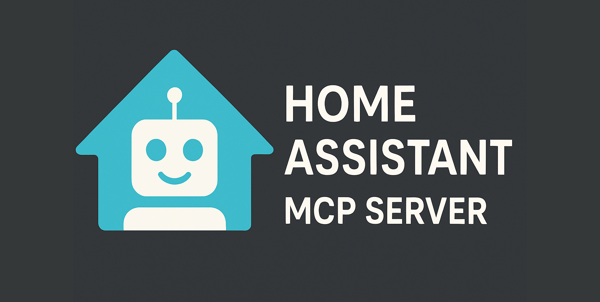

<div align="center">
  

  # The Unofficial and Awesome Home Assistant MCP Server

  <!-- mcp-name: io.github.homeassistant-ai/ha-mcp -->

  <p align="center">
    <a href="https://github.com/homeassistant-ai/ha-mcp"></a>
    <a href="https://github.com/homeassistant-ai/ha-mcp/releases"></a>
    <a href="https://github.com/homeassistant-ai/ha-mcp/actions/workflows/e2e-tests.yml"></a>
    <a href="LICENSE.md"></a>
    <br>
    <a href="https://github.com/homeassistant-ai/ha-mcp/commits/master"></a>
    <a href="https://github.com/jlowin/fastmcp"></a>
    
  </p>

  <p align="center">
    <em>A comprehensive Model Context Protocol (MCP) server that enables AI assistants to interact with Home Assistant.<br>
    Using natural language, control smart home devices, query states, execute services and manage your automations.</em>
  </p>
</div>

---


**[YouTube version →](https://youtu.be/eCO93KfSvIM)**

---

## 💬 What Can You Do With It?

Just talk to Claude naturally. Here are some real examples:

| You Say | What Happens |
|---------|--------------|
| *"Turn off all the lights in the living room"* | Finds entities by room using fuzzy search, controls them in bulk |
| *"Is everything healthy? Any devices offline?"* | Checks system health, finds unavailable entities, reports issues |
| *"Create an automation that turns on the porch light at sunset"* | Creates the automation with proper triggers and actions |
| *"The work-from-home automation doesn't work anymore, check what's going on"* | Analyzes execution traces, finds the bug, and auto-fixes it |
| *"Add milk to my shopping list"* | Finds your shopping list and adds the item |

No YAML editing. No entity ID lookups. Just describe what you want.

---

## ✨ Features

### 🔍 Discover, Search and Query
- **Fuzzy Entity Search**: Comprehensive search with similar words tolerance
- **Deep Configuration Search**: Search within automation triggers, script sequences, and helper configurations
- **AI-Optimized System Overview**: Complete system analysis showing entity counts, areas, and device status
- **Template Evaluation**: Evaluate Home Assistant templates for dynamic data processing and calculations
- **Logbook Data Access**: Query logbook entries with date filtering and entity-specific searches

### 🏠 Control
- **Universal Service Control**: Execute any Home Assistant service with full parameter support
- **Real-time State Access**: Get detailed entity states with attributes, timestamps, and context information
- **Bulk Device Control**: Control multiple devices simultaneously with WebSocket verification

### 🔧 Manage
- **Automations and Scripts**: Create, modify, delete, enable/disable, and trigger automations
- **Helper Entities**: Manage input_boolean, input_number, input_select, input_text, input_datetime, input_button
- **Groups**: Create and manage entity groups for batch control
- **Dashboards**: Create, update, delete Lovelace dashboards with strategy support
- **Areas and Floors**: Organize your smart home with areas and floor hierarchy
- **Labels**: Create and assign labels to entities and areas
- **Zones**: Define geographic zones for presence detection
- **Todo Lists**: Manage shopping lists and todo items
- **Calendar Events**: Create and manage calendar events
- **Blueprints**: Import and manage automation/script blueprints
- **Device Registry**: View and manage device information
- **Backup and Restore**: Create fast local backups and restore with safety mechanisms
- **Add-ons**: List installed and available add-ons (Supervisor only)

### 📊 Monitor & Debug
- **State History**: Query entity state changes over time with flexible time ranges
- **Long-term Statistics**: Access sensor statistics for energy, climate, and other data
- **Camera Snapshots**: Capture and retrieve images from camera entities
- **Automation Traces**: Debug automations by viewing execution traces
- **Zigbee/ZHA Devices**: Inspect ZHA devices with endpoints and cluster details

---

## 🚀 Installation

Choose the installation method that best fits your setup:

### Method 1: Running Python with UV (Recommended for Claude Desktop)

**Best for:** Claude Desktop users on any platform

> **Platform guides:** [macOS](docs/macOS-uv-guide.md) | [Windows](docs/Windows-uv-guide.md)

**Prerequisites:**
- [UV package manager](https://docs.astral.sh/uv/getting-started/installation/)
  - Windows: winget install astral-sh.uv -e
  - MacOS: brew install uv
- Your Home assistant URL (ex: http://localhost:8123) for HOMEASSISTANT_URL variable
- A Home Assistant long-lived access token (Profile → Security → Long-Lived Access Tokens) for HOMEASSISTANT_TOKEN variable

**Client Configuration:**

<details>
<summary><b>📱 Claude Desktop or any mcp.json format</b></summary>

**Config file:**
- macOS: `~/Library/Application Support/Claude/claude_desktop_config.json`
- Windows: `%APPDATA%\Claude\claude_desktop_config.json`

```json
{
  "mcpServers": {
    "Home Assistant": {
      "command": "uvx",
      "args": ["ha-mcp"],
      "env": {
        "HOMEASSISTANT_URL": "http://localhost:8123",
        "HOMEASSISTANT_TOKEN": "your_long_lived_token"
      }
    }
  }
}
```
Note: replace both HOMEASSISTANT_URL and HOMEASSISTANT_TOKEN with your values.

</details>

<details>
<summary><b>🆚 VSCode (GitHub Copilot and others)</b></summary>

**Prerequisite:** Install uvx first
- Windows: `winget install astral-sh.uv -e`
- macOS: `brew install uv`

**One-click install:**

[](vscode:mcp/install?%7B%22name%22%3A%22Home%20Assistant%22%2C%22inputs%22%3A%5B%7B%22type%22%3A%22promptString%22%2C%22id%22%3A%22homeassistant-url%22%2C%22description%22%3A%22Your%20Home%20Assistant%20URL%20(ex%3A%20http%3A%2F%2Fhomeassistant.local%3A8123)%22%2C%22default%22%3A%22http%3A%2F%2Fhomeassistant.local%3A8123%22%2C%22password%22%3Afalse%7D%2C%7B%22type%22%3A%22promptString%22%2C%22id%22%3A%22homeassistant-token%22%2C%22description%22%3A%22Your%20long%20lived%20access%20token%20(generate%20in%20your%20profile%20page%2C%20Security%20tab)%22%2C%22password%22%3Atrue%7D%5D%2C%22command%22%3A%22uvx%22%2C%22args%22%3A%5B%22ha-mcp%22%5D%2C%22env%22%3A%7B%22HOMEASSISTANT_URL%22%3A%22%24%7Binput%3Ahomeassistant-url%7D%22%2C%22HOMEASSISTANT_TOKEN%22%3A%22%24%7Binput%3Ahomeassistant-token%7D%22%7D%7D)

Clicking the button will prompt you for your Home Assistant URL and token.

</details>

<details>
<summary><b>💻 Claude Code</b></summary>

```bash
claude mcp add --transport stdio home-assistant \
  --env HOMEASSISTANT_URL=http://localhost:8123 \
  --env HOMEASSISTANT_TOKEN=your_long_lived_token \
  -- uvx ha-mcp
```

</details>

<details>
<summary><b>🌐 Web Clients (Claude.ai, ChatGPT, etc.)</b></summary>

Run the MCP server with uvx (replace the values of the environement variables):

Windows:
```bash
set HOMEASSISTANT_URL=http://localhost:8123
set HOMEASSISTANT_TOKEN=your_long_lived_token
set MCP_PORT=8086
set MCP_SECRET_PATH=/__my_secret__
uvx --from ha-mcp ha-mcp-web
```
Others:
```bash
export HOMEASSISTANT_URL=http://localhost:8123
export HOMEASSISTANT_TOKEN=your_long_lived_token
export MCP_PORT=8086
export MCP_SECRET_PATH=/__my_secret__
uvx --from ha-mcp ha-mcp-web
```

Web client required https and a public URL. You need to use a proxy in front of `http://localhost:8086`.

Easiest option is to download [Cloudflare Tunnel](https://developers.cloudflare.com/cloudflare-one/networks/connectors/cloudflare-tunnel/downloads/#latest-release)

**In another terminal, start Cloudflare Tunnel:**

```bash
cloudflared tunnel --url http://localhost:8086
```

Use the public url provided and add your secret path like so `https://XYZ.trycloudflare.com/__my_secret__`. This url must be used in your Web client MCP configuration and kept secret.
</details>

---

### Method 2: Home Assistant Add-on

**Best for:** Users running Home Assistant OS

**Advantages:**
- ✅ 5 clicks installation
- ✅ Isolated environment
- ✅ Automatic updates
- ✅ Part of your Home Assistant Setup

**Installation Steps:**

1. **Click the button to add the repository** to your Home Assistant instance:

   [](https://my.home-assistant.io/redirect/supervisor_add_addon_repository/?repository_url=https%3A%2F%2Fgithub.com%2Fhomeassistant-ai%2Fha-mcp)

   Or manually add this repository URL in Supervisor → Add-on Store:
   ```
   https://github.com/homeassistant-ai/ha-mcp
   ```

2. **Navigate to the add-on** "Home Assistant MCP Server" from the add-on store

3. **Click Install, Wait and then Start**

4. Follow the [configuration instructions for clients in the add-on documentation](homeassistant-addon/DOCS.md)

---

### Method 3: Container

**Best for:** Home Assistant Container users or when Docker is preferred

**Advantages:**
- ✅ No installation
- ✅ Isolated environment
- ✅ Automatic updates

**Get a long-lived token:** Home Assistant → Your Profile → Security → Long-Lived Access Tokens

**Client Configuration:**

<details>
<summary><b>📱 Claude Desktop or any mcp.json format</b></summary>

**Location:**
- macOS: `~/Library/Application Support/Claude/claude_desktop_config.json`
- Windows: `%APPDATA%\Claude\claude_desktop_config.json`

Add to your `mcp.json`:
```json
{
  "mcpServers": {
    "home-assistant": {
      "command": "docker",
      "args": [
        "run",
        "--rm",
        "-e", "HOMEASSISTANT_URL=http://homeassistant.local:8123",
        "-e", "HOMEASSISTANT_TOKEN=your_long_lived_token",
        "ghcr.io/homeassistant-ai/ha-mcp:latest"
      ]
    }
  }
}
```

</details>

<details>
<summary><b>🌐 Web Clients (Claude.ai, ChatGPT, etc.)</b></summary>

1. **Create a docker-compose.yml:**
   ```yaml
   version: '3.8'
   services:
     ha-mcp:
       image: ghcr.io/homeassistant-ai/ha-mcp:latest
       container_name: ha-mcp
       ports:
         - "8086:8086"
       environment:
         HOMEASSISTANT_URL: http://homeassistant.local:8123
         HOMEASSISTANT_TOKEN: your_long_lived_token
         MCP_SECRET_PATH: /__your_secret_string__
       command: ["fastmcp", "run", "fastmcp-webclient.json"]
       restart: unless-stopped

     cloudflared:
       image: cloudflare/cloudflared:latest
       command: tunnel --url http://ha-mcp:8086
       depends_on:
         - ha-mcp
   ```

2. **Start the services:**
   ```bash
   docker compose up -d
   ```

3. **Check cloudflared logs for your URL:**
   ```bash
   docker compose logs cloudflared
   ```

4. **Use:** `https://abc-def.trycloudflare.com/__your_secret_string__`

</details>

<details>
<summary><b>💻 Claude Code</b></summary>

```bash
claude mcp add-json home-assistant '{
  "command": "docker",
  "args": [
    "run",
    "--rm",
    "-e", "HOMEASSISTANT_URL=http://homeassistant.local:8123",
    "-e", "HOMEASSISTANT_TOKEN=your_long_lived_token",
    "ghcr.io/homeassistant-ai/ha-mcp:latest"
  ]
}'
```

</details>

---

## 🛠️ Available Tools (82 tools)

<details>
<summary><b>🔍 Search & Discovery (4 tools)</b></summary>

| Tool | Description |
|------|-------------|
| `ha_search_entities` | Fuzzy entity search with domain filtering |
| `ha_deep_search` | Search within automation/script/helper configurations |
| `ha_get_overview` | AI-optimized system overview with entity counts |
| `ha_get_state` | Get entity state with attributes and context |
</details>

<details>
<summary><b>🎮 Service & Device Control (5 tools)</b></summary>

| Tool | Description |
|------|-------------|
| `ha_call_service` | Execute any Home Assistant service |
| `ha_bulk_control` | Control multiple devices with WebSocket verification |
| `ha_get_operation_status` | Check status of device operations |
| `ha_get_bulk_status` | Check status of multiple operations |
| `ha_list_services` | List available services by domain |
</details>

<details>
<summary><b>⚙️ Automations (3 tools)</b></summary>

| Tool | Description |
|------|-------------|
| `ha_config_get_automation` | Get automation configuration |
| `ha_config_set_automation` | Create/update automations |
| `ha_config_remove_automation` | Delete automations |
</details>

<details>
<summary><b>📜 Scripts (3 tools)</b></summary>

| Tool | Description |
|------|-------------|
| `ha_config_get_script` | Get script configuration |
| `ha_config_set_script` | Create/update scripts |
| `ha_config_remove_script` | Delete scripts |
</details>

<details>
<summary><b>🔘 Helper Entities (3 tools)</b></summary>

| Tool | Description |
|------|-------------|
| `ha_config_list_helpers` | List all helper entities |
| `ha_config_set_helper` | Create/update helper entities |
| `ha_config_remove_helper` | Delete helper entities |
</details>

<details>
<summary><b>📊 Dashboards (8 tools)</b></summary>

| Tool | Description |
|------|-------------|
| `ha_config_list_dashboards` | List all storage-mode dashboards |
| `ha_config_get_dashboard` | Get dashboard configuration |
| `ha_config_set_dashboard` | Create/update dashboard |
| `ha_config_update_dashboard_metadata` | Update dashboard title/icon |
| `ha_config_delete_dashboard` | Delete dashboard |
| `ha_get_dashboard_guide` | Get dashboard creation guide |
| `ha_get_card_types` | List available dashboard card types |
| `ha_get_card_documentation` | Get documentation for specific card type |
</details>

<details>
<summary><b>🏠 Areas & Floors (6 tools)</b></summary>

| Tool | Description |
|------|-------------|
| `ha_config_list_areas` | List all areas |
| `ha_config_set_area` | Create/update area |
| `ha_config_remove_area` | Delete area |
| `ha_config_list_floors` | List all floors |
| `ha_config_set_floor` | Create/update floor |
| `ha_config_remove_floor` | Delete floor |
</details>

<details>
<summary><b>🏷️ Labels (5 tools)</b></summary>

| Tool | Description |
|------|-------------|
| `ha_config_list_labels` | List all labels |
| `ha_config_get_label` | Get label details |
| `ha_config_set_label` | Create/update label |
| `ha_config_remove_label` | Delete label |
| `ha_assign_label` | Assign label to entity/area |
</details>

<details>
<summary><b>📍 Zones (4 tools)</b></summary>

| Tool | Description |
|------|-------------|
| `ha_list_zones` | List all zones |
| `ha_create_zone` | Create geographic zone |
| `ha_update_zone` | Update zone properties |
| `ha_delete_zone` | Delete zone |
</details>

<details>
<summary><b>👥 Groups (3 tools)</b></summary>

| Tool | Description |
|------|-------------|
| `ha_config_list_groups` | List all entity groups |
| `ha_config_set_group` | Create/update entity group |
| `ha_config_remove_group` | Delete entity group |
</details>

<details>
<summary><b>✅ Todo Lists (5 tools)</b></summary>

| Tool | Description |
|------|-------------|
| `ha_list_todo_lists` | List all todo lists |
| `ha_get_todo_items` | Get items from a todo list |
| `ha_add_todo_item` | Add item to todo list |
| `ha_update_todo_item` | Update todo item |
| `ha_remove_todo_item` | Remove todo item |
</details>

<details>
<summary><b>📅 Calendar (3 tools)</b></summary>

| Tool | Description |
|------|-------------|
| `ha_config_get_calendar_events` | Get calendar events |
| `ha_config_set_calendar_event` | Create/update calendar event |
| `ha_config_remove_calendar_event` | Delete calendar event |
</details>

<details>
<summary><b>📋 Blueprints (3 tools)</b></summary>

| Tool | Description |
|------|-------------|
| `ha_list_blueprints` | List available blueprints |
| `ha_get_blueprint` | Get blueprint details |
| `ha_import_blueprint` | Import blueprint from URL |
</details>

<details>
<summary><b>📱 Device Registry (5 tools)</b></summary>

| Tool | Description |
|------|-------------|
| `ha_list_devices` | List all devices |
| `ha_get_device` | Get device details |
| `ha_update_device` | Update device properties |
| `ha_remove_device` | Remove device from registry |
| `ha_rename_entity` | Rename entity ID |
</details>

<details>
<summary><b>📡 ZHA & Integration Tools (2 tools)</b></summary>

| Tool | Description |
|------|-------------|
| `ha_get_zha_devices` | List ZHA (Zigbee) devices with endpoints and clusters |
| `ha_get_entity_integration_source` | Get integration source for any entity |
</details>

<details>
<summary><b>🔌 Add-ons (2 tools)</b></summary>

| Tool | Description |
|------|-------------|
| `ha_list_addons` | List installed add-ons (Supervisor only) |
| `ha_list_available_addons` | List available add-ons from repositories |
</details>

<details>
<summary><b>📷 Camera (1 tool)</b></summary>

| Tool | Description |
|------|-------------|
| `ha_get_camera_image` | Capture and retrieve camera snapshot |
</details>

<details>
<summary><b>📈 History & Statistics (2 tools)</b></summary>

| Tool | Description |
|------|-------------|
| `ha_get_history` | Query entity state history with time range |
| `ha_get_statistics` | Get long-term statistics for sensors |
</details>

<details>
<summary><b>🐞 Automation Traces (1 tool)</b></summary>

| Tool | Description |
|------|-------------|
| `ha_get_automation_traces` | Get execution traces for automation debugging |
</details>

<details>
<summary><b>🔄 System & Updates (8 tools)</b></summary>

| Tool | Description |
|------|-------------|
| `ha_check_config` | Validate configuration |
| `ha_restart` | Restart Home Assistant |
| `ha_reload_core` | Reload core configuration |
| `ha_get_system_info` | Get system information |
| `ha_get_system_health` | Get system health status |
| `ha_list_updates` | List available updates |
| `ha_get_release_notes` | Get release notes for update |
| `ha_get_system_version` | Get Home Assistant version |
</details>

<details>
<summary><b>💾 Backup & Restore (2 tools)</b></summary>

| Tool | Description |
|------|-------------|
| `ha_backup_create` | Create fast local backup |
| `ha_backup_restore` | Restore from backup |
</details>

<details>
<summary><b>🧰 Utility (4 tools)</b></summary>

| Tool | Description |
|------|-------------|
| `ha_get_logbook` | Access historical logbook entries |
| `ha_eval_template` | Evaluate Jinja2 templates |
| `ha_get_domain_docs` | Get domain documentation |
| `ha_list_integrations` | List installed integrations |
</details>

---

## ⚙️ Configuration Options

### Environment Variables

| Variable | Description | Default | Required |
|----------|-------------|---------|----------|
| `HOMEASSISTANT_URL` | Home Assistant URL | - | Yes |
| `HOMEASSISTANT_TOKEN` | Long-lived access token | - | Yes |
| `BACKUP_HINT` | Backup recommendation level | `normal` | No |

**Backup Hint Modes:**
- `strong`: Suggests backup before first modification each day/session
- `normal`: Suggests backup only before irreversible operations (recommended)
- `weak`: Rarely suggests backups
- `auto`: Same as normal (future: auto-detection)

---

## 🤝 Contributing

For development setup, testing instructions, and contribution guidelines, see **[CONTRIBUTING.md](CONTRIBUTING.md)**.

For comprehensive testing documentation, see **[tests/README.md](tests/README.md)**.

---

## 🛣️ Development Roadmap

### Completed ✅
- [x] Core infrastructure and HTTP client
- [x] FastMCP integration with OpenAPI auto-generation
- [x] Smart search tools with fuzzy matching
- [x] Optimized tool documentation to reduce tool call errors
- [x] WebSocket async device control
- [x] Logbook history and operational insights
- [x] Comprehensive test suite
- [x] Home Assistant Add-on support
- [x] Docker images with multi-mode support

For future enhancements and planned features, see the [Development Roadmap](https://github.com/homeassistant-ai/ha-mcp/wiki) in our wiki.

---

## 🔒 Privacy

Ha-mcp runs **locally** on your machine. Your smart home data stays on your network.

- **No telemetry currently** — may add optional anonymous stats in future
- **No personal data collection** — we never collect entity names, configs, or device data
- **User-controlled bug reports** — only sent with your explicit approval

For full details, see our [Privacy Policy](PRIVACY.md).

---

## 📄 License

This project is licensed under the MIT License - see the [LICENSE](LICENSE) file for details.

---

## 🙏 Acknowledgments

- **[Home Assistant](https://home-assistant.io/)**: Amazing smart home platform (!)
- **[FastMCP](https://github.com/jlowin/fastmcp)**: Excellent MCP server framework
- **[Model Context Protocol](https://modelcontextprotocol.io/)**: Standardized AI-application communication
- **[Claude Code](https://github.com/anthropics/claude-code)**: AI-powered coding assistant

## 👥 Contributors

- **[@julienld](https://github.com/julienld)** — Project maintainer & core contributor.
- **[@kingbear2](https://github.com/kingbear2)** — Windows UV setup guide.
