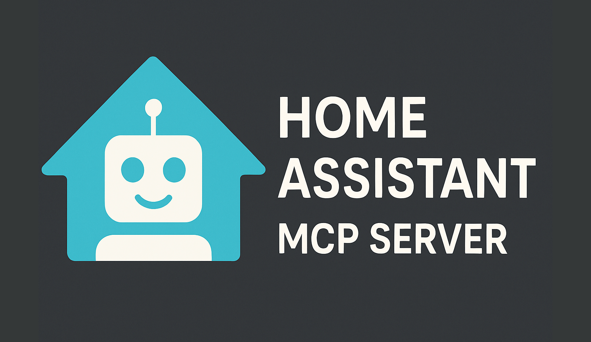

<div align="center">
  

  # The Unofficial and Awesome Home Assistant MCP Server

  <p align="center">
    <a href="https://github.com/homeassistant-ai/ha-mcp"></a>
    <a href="https://github.com/homeassistant-ai/ha-mcp/releases"></a>
    <a href="https://github.com/homeassistant-ai/ha-mcp/actions/workflows/e2e-tests.yml"></a>
    <a href="LICENSE.md"></a>
    <br>
    <a href="https://github.com/homeassistant-ai/ha-mcp/commits/master"></a>
    <a href="https://github.com/jlowin/fastmcp"></a>
    
  </p>

  <p align="center">
    <em>A comprehensive Model Context Protocol (MCP) server that enables AI assistants to interact with Home Assistant.<br>
    Using natural language, control smart home devices, query states, execute services and manage your automations.</em>
  </p>
</div>

---


**[YouTube version →](https://youtu.be/eCO93KfSvIM)**

---

## ✨ Features

### 🔍 Discover, Search and Query
- **Fuzzy Entity Search**: Comprehensive search with typo tolerance
- **AI-Optimized System Overview**: Complete system analysis showing entity counts, areas, and device status
- **Intelligent Entity Matching**: Advanced search across all Home Assistant entities with partial name matching
- **Template Evaluation**: Evaluate Home Assistant templates for dynamic data processing and calculations
- **Logbook Data Access**: Query logbook entries with date filtering and entity-specific searches

### 🏠 Control
- **Universal Service Control**: Execute any Home Assistant service with full parameter support
- **Real-time State Access**: Get detailed entity states with attributes, timestamps, and context information

### 🔧 Manage
- **Automation and Scripts**: Create, modify, delete, enable/disable, and trigger Home Assistant automations
- **Helper Entity Management**: Create, modify, and delete input_boolean, input_number, input_select, input_text, input_datetime, and input_button entities
- **Backup and Restore**: Create fast local backups (excludes database) and restore with safety mechanisms

---

## 🚀 Installation

Choose the installation method that best fits your setup:

### Method 1: Home Assistant Add-on (Recommended)

**Best for:** Users running Home Assistant OS or Supervised

**Advantages:**
- ✅ One-click installation
- ✅ Automatic updates
- ✅ Built-in authentication
- ✅ No external dependencies
- ✅ Network accessible by default

**Installation Steps:**

1. **Add the repository** to your Home Assistant instance:

   [](https://my.home-assistant.io/redirect/supervisor_add_addon_repository/?repository_url=https%3A%2F%2Fgithub.com%2Fhomeassistant-ai%2Fha-mcp)

   Or manually add this repository URL in Supervisor → Add-on Store:
   ```
   https://github.com/homeassistant-ai/ha-mcp
   ```

2. **Install the add-on** from the add-on store

3. **Configure** (optional):
   - `backup_hint`: Control backup recommendations (`normal`, `strong`, `weak`)
   - `port`: HTTP port (default: `9583`)
   - `path`: MCP endpoint path (default: `/mcp`)
   - `require_auth`: Enable MCP authentication (default: `false`)

4. **Start the add-on** and check logs

5. **Connect from AI clients:**

<details>
<summary><b>📱 Claude Desktop / MCP Clients</b></summary>

Add to your `mcp.json` or Claude Desktop configuration:

```json
{
  "mcpServers": {
    "home-assistant": {
      "url": "http://<your-home-assistant-ip>:9583/mcp",
      "transport": "http"
    }
  }
}
```

Replace `<your-home-assistant-ip>` with your Home Assistant's local IP address (e.g., `192.168.1.100`).

</details>

<details>
<summary><b>🌐 Web Clients (Claude.ai, ChatGPT, etc.)</b></summary>

**⚠️ Security Warning:** Remote access exposes your setup to the internet. Always use a secret path.

1. **Configure secret path** in add-on settings:
   ```yaml
   path: "/__your_secret_path_here__"
   ```

2. **Set up Cloudflare Tunnel:**
   ```bash
   # Install cloudflared
   # See: https://developers.cloudflare.com/cloudflare-one/connections/connect-networks/downloads/

   cloudflared tunnel --url http://localhost:9583
   ```

3. **Use the URL:** `https://abc-def.trycloudflare.com/__your_secret_path_here__`

4. **Configure in web clients:**
   - [Claude.ai setup](https://support.anthropic.com/en/articles/11176164-pre-built-web-connectors-using-remote-mcp)
   - [ChatGPT setup](https://help.openai.com/en/articles/11487775-connectors-in-chatgpt)

</details>

<details>
<summary><b>💻 Claude Code</b></summary>

```bash
claude mcp add-json home-assistant '{
  "url": "http://<your-home-assistant-ip>:9583/mcp",
  "transport": "http"
}'
```

Replace `<your-home-assistant-ip>` with your Home Assistant's IP address.

</details>

#### 🌐 Remote Access with Cloudflared Addon (Recommended)

**Best for:** Secure remote access without port forwarding or manual cloudflared setup

If you need to access your HA MCP server remotely (for Claude.ai, ChatGPT, etc.), use the **Cloudflared addon** instead of manual tunnel setup. It's easier, more secure, and centrally managed.

**Why use Cloudflared addon:**
- ✅ No port forwarding required
- ✅ Automatic DNS management (if you have a domain)
- ✅ Manages all your Home Assistant services in one place
- ✅ Optional Cloudflare Zero Trust authentication
- ✅ Quick tunnels available (no domain required)

**Setup:**

1. **Install Cloudflared addon:**

   [](https://my.home-assistant.io/redirect/supervisor_add_addon_repository/?repository_url=https%3A%2F%2Fgithub.com%2Fbrenner-tobias%2Faddon-cloudflared)

2. **Configure the addon** to expose HA MCP:

   Add to Cloudflared addon configuration:
   ```yaml
   additional_hosts:
     - hostname: ha-mcp.yourdomain.com
       service: http://localhost:9583
   ```

   **Note:** If you don't have a domain, Cloudflared addon supports quick tunnels (temporary URLs) - check the addon documentation for details.

3. **Configure secret path** in HA MCP addon for security:
   ```yaml
   # HA MCP addon configuration
   path: "/__your_secret_path__"
   ```

4. **Use in web clients:**
   ```
   https://ha-mcp.yourdomain.com/__your_secret_path__
   ```

**See also:** [Cloudflared addon documentation](https://github.com/brenner-tobias/addon-cloudflared/blob/main/cloudflared/DOCS.md)

---

### Method 2: Docker Container

**Best for:** Users with Docker/Podman setup or running Home Assistant Container

**Advantages:**
- ✅ Isolated environment
- ✅ Easy updates via image tags
- ✅ Supports both stdio and HTTP modes
- ✅ Platform independent

**Get a long-lived token:** Home Assistant → Profile → Security → Long-Lived Access Tokens

#### Option A: stdio mode (for Claude Desktop, VSCode, etc.)

```bash
# Pull the image
docker pull ghcr.io/homeassistant-ai/ha-mcp:latest
```

Add to your `mcp.json`:
```json
{
  "mcpServers": {
    "home-assistant": {
      "command": "docker",
      "args": [
        "run",
        "--rm", "-i",
        "-e", "HOMEASSISTANT_URL=http://host.docker.internal:8123",
        "-e", "HOMEASSISTANT_TOKEN=your_long_lived_token",
        "ghcr.io/homeassistant-ai/ha-mcp:latest"
      ]
    }
  }
}
```

**Note:** Use `host.docker.internal` to access Home Assistant from Docker on the same machine.

#### Option B: HTTP mode (for Claude Code, remote clients, web)

```bash
# Run the server in HTTP mode
docker run -d \
  --name ha-mcp \
  -p 8086:8086 \
  -e HOMEASSISTANT_URL=http://homeassistant.local:8123 \
  -e HOMEASSISTANT_TOKEN=your_long_lived_token \
  ghcr.io/homeassistant-ai/ha-mcp:latest \
  python -c "from ha_mcp.__main__ import mcp; mcp.run(transport='streamable-http', host='0.0.0.0', port=8086)"
```

**Client Configuration:**

<details>
<summary><b>📱 Claude Desktop / MCP Clients</b></summary>

```json
{
  "mcpServers": {
    "home-assistant": {
      "url": "http://localhost:8086/mcp",
      "transport": "http"
    }
  }
}
```

</details>

<details>
<summary><b>🌐 Web Clients (Claude.ai, ChatGPT, etc.)</b></summary>

**⚠️ Security Warning:** Remote access exposes your setup to the internet. Always use a secret path.

1. **Run with secret path:**
   ```bash
   docker run -d \
     --name ha-mcp \
     -p 8086:8086 \
     -e HOMEASSISTANT_URL=http://homeassistant.local:8123 \
     -e HOMEASSISTANT_TOKEN=your_token \
     ghcr.io/homeassistant-ai/ha-mcp:latest \
     python -c "from ha_mcp.__main__ import mcp; mcp.run(transport='streamable-http', host='0.0.0.0', port=8086, path='/__my_secret__')"
   ```

2. **Set up Cloudflare Tunnel:**
   ```bash
   cloudflared tunnel --url http://localhost:8086
   ```

3. **Use:** `https://abc-def.trycloudflare.com/__my_secret__`

</details>

<details>
<summary><b>💻 Claude Code</b></summary>

```bash
claude mcp add-json home-assistant '{
  "url": "http://localhost:8086/mcp",
  "transport": "http"
}'
```

</details>

**Docker Compose example:**

```yaml
version: '3.8'
services:
  ha-mcp:
    image: ghcr.io/homeassistant-ai/ha-mcp:latest
    container_name: ha-mcp
    ports:
      - "8086:8086"
    environment:
      HOMEASSISTANT_URL: http://homeassistant.local:8123
      HOMEASSISTANT_TOKEN: your_long_lived_token
      BACKUP_HINT: normal
    command: >
      python -c "from ha_mcp.__main__ import mcp;
      mcp.run(transport='streamable-http', host='0.0.0.0', port=8086)"
    restart: unless-stopped
```

---

### Method 3: Python/UV Installation

**Best for:** Users who prefer local installation or want bleeding-edge features

**Prerequisites:**
- Python 3.11+
- [UV package manager](https://docs.astral.sh/uv/getting-started/installation/)

**Installation Steps:**

1. **Clone the repository:**
   ```bash
   git clone https://github.com/homeassistant-ai/ha-mcp
   cd ha-mcp
   ```

2. **Install dependencies:**
   ```bash
   uv sync
   ```

3. **Configure environment:**
   ```bash
   cp .env.example .env
   # Edit .env with your Home Assistant URL and token
   ```

4. **Choose your mode:**

#### stdio mode (Claude Desktop, VSCode, etc.)

Add to your MCP client config:
```json
{
  "mcpServers": {
    "home-assistant": {
      "command": "uv",
      "args": [
        "--directory", "/path/to/ha-mcp",
        "run", "ha-mcp"
      ],
      "env": {
        "HOMEASSISTANT_URL": "http://localhost:8123",
        "HOMEASSISTANT_TOKEN": "your_token"
      }
    }
  }
}
```

#### HTTP mode (Claude Code, remote clients, web)

```bash
# Start the server
uv run python -c "from ha_mcp.__main__ import mcp; mcp.run(transport='streamable-http', port=8086)"
```

**Client Configuration:**

<details>
<summary><b>📱 Claude Desktop / MCP Clients</b></summary>

```json
{
  "mcpServers": {
    "home-assistant": {
      "url": "http://localhost:8086/mcp",
      "transport": "http"
    }
  }
}
```

</details>

<details>
<summary><b>🌐 Web Clients (Claude.ai, ChatGPT, etc.)</b></summary>

**⚠️ Security Warning:** Use a secret path for remote access.

1. **Run with secret path:**
   ```bash
   uv run python -c "from ha_mcp.__main__ import mcp; mcp.run(transport='streamable-http', port=8086, path='/__my_secret__')"
   ```

2. **Set up Cloudflare Tunnel:**
   ```bash
   cloudflared tunnel --url http://localhost:8086
   ```

3. **Use:** `https://abc-def.trycloudflare.com/__my_secret__`

</details>

<details>
<summary><b>💻 Claude Code</b></summary>

```bash
claude mcp add-json home-assistant '{
  "url": "http://localhost:8086/mcp",
  "transport": "http"
}'
```

</details>

**Development:** See [CONTRIBUTING.md](CONTRIBUTING.md) for testing and contribution guidelines.

---

## 🛠️ Available Tools

### Search & Discovery Tools
| Tool | Description | Example |
|------|-------------|---------|
| `ha_search_entities` | Comprehensive entity search with fuzzy matching | `ha_search_entities("lumiere salon")` |
| `ha_get_overview` | AI-optimized system overview with entity counts | `ha_get_overview()` |

### Core Home Assistant API Tools
| Tool | Description | Example |
|------|-------------|---------|
| `ha_get_state` | Get entity state with attributes and context | `ha_get_state("light.living_room")` |
| `ha_call_service` | Execute any Home Assistant service (universal control) | `ha_call_service("light", "turn_on", {"entity_id": "light.all"})` |

### Device Control Tools
| Tool | Description | Example |
|------|-------------|---------|
| `ha_bulk_control` | Control multiple devices with WebSocket verification | `ha_bulk_control([{"entity_id": "light.all", "action": "turn_on"}])` |
| `ha_get_operation_status` | Check status of device operations | `ha_get_operation_status("operation_id")` |
| `ha_get_bulk_status` | Check status of multiple operations | `ha_get_bulk_status(["op1", "op2"])` |

### Configuration Management Tools
| Tool | Description | Example |
|------|-------------|---------|
| `ha_config_set_helper` | Create/update helper entities | `ha_config_set_helper("input_boolean", "test")` |
| `ha_config_remove_helper` | Delete helper entities | `ha_config_remove_helper("input_boolean", "test")` |
| `ha_config_set_script` | Create/update scripts | `ha_config_set_script("script_id", config)` |
| `ha_config_get_script` | Get script configuration | `ha_config_get_script("script_id")` |
| `ha_config_remove_script` | Delete scripts | `ha_config_remove_script("script_id")` |
| `ha_config_set_automation` | Create/update automations | `ha_config_set_automation(config)` |
| `ha_config_get_automation` | Get automation configuration | `ha_config_get_automation("automation.id")` |
| `ha_config_remove_automation` | Delete automations | `ha_config_remove_automation("automation.id")` |

### Convenience Tools
| Tool | Description | Example |
|------|-------------|---------|
| `ha_activate_scene` | Activate a Home Assistant scene | `ha_activate_scene("scene.movie_time")` |
| `ha_get_weather` | Get current weather information | `ha_get_weather()` |
| `ha_get_energy` | Get energy usage information | `ha_get_energy()` |
| `ha_get_logbook` | Access historical logbook entries | `ha_get_logbook(hours_back=24)` |

### Backup & Restore Tools
| Tool | Description | Example |
|------|-------------|---------|
| `ha_backup_create` | Create fast local backup | `ha_backup_create("backup_name")` |
| `ha_backup_restore` | Restore from backup | `ha_backup_restore("backup_id")` |

### Template & Documentation Tools
| Tool | Description | Example |
|------|-------------|---------|
| `ha_eval_template` | Evaluate Jinja2 templates | `ha_eval_template("{{ states('sensor.temp') }}")` |
| `ha_get_domain_docs` | Get Home Assistant domain documentation | `ha_get_domain_docs("light")` |

---

## ⚙️ Configuration Options

### Environment Variables

| Variable | Description | Default | Required |
|----------|-------------|---------|----------|
| `HOMEASSISTANT_URL` | Home Assistant URL | - | Yes |
| `HOMEASSISTANT_TOKEN` | Long-lived access token | - | Yes |
| `BACKUP_HINT` | Backup recommendation level | `normal` | No |

**Backup Hint Modes:**
- `strong`: Suggests backup before first modification each day/session
- `normal`: Suggests backup only before irreversible operations (recommended)
- `weak`: Rarely suggests backups
- `auto`: Same as normal (future: auto-detection)

---

## 🤝 Contributing

For development setup, testing instructions, and contribution guidelines, see **[CONTRIBUTING.md](CONTRIBUTING.md)**.

For comprehensive testing documentation, see **[tests/README.md](tests/README.md)**.

---

## 🛣️ Development Roadmap

### Completed ✅
- [x] Core infrastructure and HTTP client
- [x] FastMCP integration with OpenAPI auto-generation
- [x] Smart search tools with fuzzy matching
- [x] Optimized tool documentation to reduce tool call errors
- [x] WebSocket async device control
- [x] Convenience tools for scenes and automations
- [x] Comprehensive test suite
- [x] Home Assistant Add-on support
- [x] Docker images with multi-mode support

For future enhancements and planned features, see the [Development Roadmap](https://github.com/homeassistant-ai/ha-mcp/wiki) in our wiki.

---

## 📄 License

This project is licensed under the MIT License - see the [LICENSE](LICENSE) file for details.

---

## 🙏 Acknowledgments

- **[Home Assistant](https://home-assistant.io/)**: Amazing smart home platform (!)
- **[FastMCP](https://github.com/jlowin/fastmcp)**: Excellent MCP server framework
- **[Model Context Protocol](https://modelcontextprotocol.io/)**: Standardized AI-application communication
- **[Claude Code](https://github.com/anthropics/claude-code)**: AI-powered coding assistant

