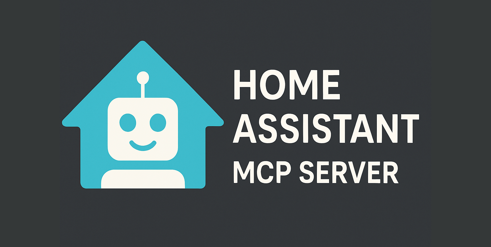

> **Breaking change (v7.3.0):** `ha_config_set_yaml` has been moved to [beta](docs/beta.md).

<div align="center">
  

  # The Unofficial and Awesome Home Assistant MCP Server

  <!-- mcp-name: io.github.homeassistant-ai/ha-mcp -->

  <p align="center">
    
    <a href="https://github.com/homeassistant-ai/ha-mcp/releases"></a>
    <a href="https://github.com/homeassistant-ai/ha-mcp/actions/workflows/e2e-tests.yml"></a>
    <a href="LICENSE.md"></a>
    <br>
    <a href="https://github.com/homeassistant-ai/ha-mcp/commits/master"></a>
    <a href="https://github.com/jlowin/fastmcp"></a>
    
    <a href="https://github.com/sponsors/julienld"></a>
    <a href="https://homeassistant-ai.github.io/ha-mcp/"></a>
  </p>

  <p align="center">
    <em>A comprehensive Model Context Protocol (MCP) server that enables AI assistants to interact with Home Assistant.<br>
    Using natural language, control smart home devices, query states, execute services and manage your automations.</em>
  </p>
</div>

---


---

## 🚀 Get Started

### Full guide to get you started with Claude Desktop (~10 min)

*No paid subscription required.* Click on your operating system:

<p>
<a href="https://homeassistant-ai.github.io/ha-mcp/guide-macos/"></a>&nbsp;&nbsp;&nbsp;&nbsp;<a href="https://homeassistant-ai.github.io/ha-mcp/guide-windows/"></a>
</p>

### Quick install (~5 min)

<details>
<summary><b>🍎 macOS</b></summary>

1. Go to [claude.ai](https://claude.ai) and sign in (or create a free account)
2. Open **Terminal** and run:
   ```sh
   curl -LsSf https://raw.githubusercontent.com/homeassistant-ai/ha-mcp/master/scripts/install-macos.sh | sh
   ```
3. [Download Claude Desktop](https://claude.ai/download) (or restart: Claude menu → Quit)
4. Ask Claude: **"Can you see my Home Assistant?"**

You're now connected to the demo environment! [Connect your own Home Assistant →](https://homeassistant-ai.github.io/ha-mcp/guide-macos/#step-6-connect-your-home-assistant)

</details>

<details>
<summary><b>🪟 Windows</b></summary>

1. Go to [claude.ai](https://claude.ai) and sign in (or create a free account)
2. Open **Windows PowerShell** (from Start menu) and run:
   ```powershell
   irm https://raw.githubusercontent.com/homeassistant-ai/ha-mcp/master/scripts/install-windows.ps1 | iex
   ```
3. [Download Claude Desktop](https://claude.ai/download) (or restart: File → Exit)
4. Ask Claude: **"Can you see my Home Assistant?"**

You're now connected to the demo environment! [Connect your own Home Assistant →](https://homeassistant-ai.github.io/ha-mcp/guide-windows/#step-6-connect-your-home-assistant)

</details>

<details>
<summary><b>🏠 Home Assistant OS (Add-on)</b></summary>

1. Add the repository to your Home Assistant instance:

   [](https://my.home-assistant.io/redirect/supervisor_add_addon_repository/?repository_url=https%3A%2F%2Fgithub.com%2Fhomeassistant-ai%2Fha-mcp)

2. Install **"Home Assistant MCP Server"** from the Add-on Store and wait for it to complete
3. Click **Start**, then open the **Logs** tab to find your unique MCP URL
4. Configure your AI client with that URL

No token or credential setup needed — the add-on connects to Home Assistant automatically.

[Full add-on documentation →](homeassistant-addon/DOCS.md)

</details>

<details>
<summary><b>🌐 Remote Access (Nabu Casa / Webhook Proxy)</b></summary>

Already have **Nabu Casa** or another reverse proxy pointing at your Home Assistant? The Webhook Proxy add-on routes MCP traffic through your existing setup — no separate tunnel or port forwarding needed.

1. Install the **MCP Server add-on** (see above) and the **Webhook Proxy** add-on from the same store
2. Start the webhook proxy and **restart Home Assistant** when prompted
3. Copy the webhook URL from the add-on logs:
   ```
   MCP Server URL (remote): https://xxxxx.ui.nabu.casa/api/webhook/mcp_xxxxxxxx
   ```
4. Configure your AI client with that URL

For other remote access methods (Cloudflare Tunnel, custom reverse proxy), see the [Setup Wizard](https://homeassistant-ai.github.io/ha-mcp/setup/).

[Webhook proxy documentation →](https://github.com/homeassistant-ai/ha-mcp/blob/master/homeassistant-addon-webhook-proxy/DOCS.md)

</details>

### 🧙 Setup Wizard for 15+ clients

**Claude Code, Gemini CLI, ChatGPT, Open WebUI, VSCode, Cursor, and more.**

<p>
<a href="https://homeassistant-ai.github.io/ha-mcp/setup/"></a>
</p>

Having issues? Check the **[FAQ & Troubleshooting](https://homeassistant-ai.github.io/ha-mcp/faq/)**

---

## 💬 What Can You Do With It?

Just talk to Claude naturally. Here are some real examples:

| You Say | What Happens |
|---------|--------------|
| *"Create an automation that turns on the porch light at sunset"* | Creates the automation with proper triggers and actions |
| *"Add a weather card to my dashboard"* | Updates your Lovelace dashboard with the new card |
| *"The motion sensor automation isn't working, debug it"* | Analyzes execution traces, identifies the issue, suggests fixes |
| *"Make my morning routine automation also turn on the coffee maker"* | Reads the existing automation, adds the new action, updates it |
| *"Create a script that sets movie mode: dim lights, close blinds, turn on TV"* | Creates a reusable script with the sequence of actions |

Spend less time configuring, more time enjoying your smart home.

---

## ✨ Features

| Category | Capabilities |
|----------|--------------|
| **🔍 Search** | Fuzzy entity search, deep config search, system overview |
| **🏠 Control** | Any service, bulk device control, real-time states |
| **🔧 Manage** | Automations, scripts, helpers, dashboards, areas, zones, groups, calendars, blueprints |
| **📊 Monitor** | History, statistics, camera snapshots, automation traces, ZHA devices |
| **💾 System** | Backup/restore, updates, add-ons, device registry |

<details>
<!-- TOOLS_TABLE_START -->

<summary><b>Complete Tool List (86 tools)</b></summary>

| Category | Tools |
|----------|-------|
| **Add-ons** | `ha_get_addon`, `ha_manage_addon` |
| **Areas & Floors** | `ha_config_list_areas`, `ha_config_list_floors`, `ha_config_remove_area`, `ha_config_remove_floor`, `ha_config_set_area`, `ha_config_set_floor`, `ha_list_floors_areas` |
| **Automations** | `ha_config_get_automation`, `ha_config_remove_automation`, `ha_config_set_automation` |
| **Blueprints** | `ha_get_blueprint`, `ha_import_blueprint` |
| **Calendar** | `ha_config_get_calendar_events`, `ha_config_remove_calendar_event`, `ha_config_set_calendar_event` |
| **Camera** | `ha_get_camera_image` |
| **Dashboards** | `ha_config_delete_dashboard_resource`, `ha_config_delete_dashboard`, `ha_config_get_dashboard`, `ha_config_list_dashboard_resources`, `ha_config_set_dashboard_resource`, `ha_config_set_dashboard` |
| **Device Registry** | `ha_get_device`, `ha_remove_device`, `ha_update_device` |
| **Energy** | `ha_manage_energy_prefs` |
| **Entity Registry** | `ha_get_entity_exposure`, `ha_get_entity`, `ha_remove_entity`, `ha_set_entity` |
| **Files** | `ha_delete_file` *(beta)*, `ha_list_files` *(beta)*, `ha_read_file` *(beta)*, `ha_write_file` *(beta)* |
| **Groups** | `ha_config_list_groups`, `ha_config_remove_group`, `ha_config_set_group` |
| **HACS** | `ha_hacs_add_repository`, `ha_hacs_download`, `ha_hacs_repository_info`, `ha_hacs_search` |
| **Helper Entities** | `ha_config_list_helpers`, `ha_config_set_helper`, `ha_delete_helpers_integrations`, `ha_get_helper_schema` |
| **History & Statistics** | `ha_get_automation_traces`, `ha_get_history`, `ha_get_logs` |
| **Integrations** | `ha_get_integration`, `ha_set_integration_enabled` |
| **Labels & Categories** | `ha_config_get_category`, `ha_config_get_label`, `ha_config_remove_category`, `ha_config_remove_label`, `ha_config_set_category`, `ha_config_set_label` |
| **Scripts** | `ha_config_get_script`, `ha_config_remove_script`, `ha_config_set_script` |
| **Search & Discovery** | `ha_deep_search`, `ha_get_overview`, `ha_get_state`, `ha_search_entities` |
| **Service & Device Control** | `ha_bulk_control`, `ha_call_service`, `ha_get_operation_status`, `ha_list_services` |
| **System** | `ha_backup_create`, `ha_backup_restore`, `ha_check_config`, `ha_config_set_yaml` *(beta)*, `ha_get_system_health`, `ha_get_updates`, `ha_reload_core`, `ha_restart` |
| **Todo Lists** | `ha_get_todo`, `ha_remove_todo_item`, `ha_set_todo_item` |
| **Utilities** | `ha_eval_template`, `ha_install_mcp_tools` *(beta)*, `ha_report_issue` |
| **Zones** | `ha_get_zone`, `ha_remove_zone`, `ha_set_zone` |

<!-- TOOLS_TABLE_END -->
</details>

---

## 🔌 Custom Component (ha_mcp_tools) *(beta)*

Some tools require a companion custom component installed in Home Assistant. Standard HA APIs do not expose file system access or YAML config editing. This component provides both.

**Tools that require the component:**

| Tool | Description |
|------|-------------|
| `ha_config_set_yaml` *(beta)* | Safely add, replace, or remove top-level YAML keys in `configuration.yaml` and package files (automatic backup, validation, and config check) |
| `ha_list_files` *(beta)* | List files in allowed directories (www/, themes/, custom_templates/) |
| `ha_read_file` *(beta)* | Read files from allowed paths (config YAML, logs, www/, themes/, custom_templates/, custom_components/) |
| `ha_write_file` *(beta)* | Write files to allowed directories |
| `ha_delete_file` *(beta)* | Delete files from allowed directories |

All other tools work without the component. These five return an error with installation instructions if the component is missing.

These tools also require feature flags: `HAMCP_ENABLE_FILESYSTEM_TOOLS=true` (file tools) and `ENABLE_YAML_CONFIG_EDITING=true` (YAML editing). To enable the `ha_install_mcp_tools` installer tool, set `HAMCP_ENABLE_CUSTOM_COMPONENT_INTEGRATION=true`.

### Install using HACS (recommended)

[](https://my.home-assistant.io/redirect/hacs_repository/?owner=homeassistant-ai&repository=ha-mcp&category=integration)

To add manually: open **HACS** > **Integrations** > three-dot menu > **Custom repositories** > add `https://github.com/homeassistant-ai/ha-mcp` (category: Integration) > **Download**.

After installing, restart Home Assistant. Then open **Settings** > **Devices & Services** > **Add Integration** and search for **HA MCP Tools**.

### Install manually

Copy `custom_components/ha_mcp_tools/` from this repository into your HA `config/custom_components/` directory. Restart Home Assistant, then add the integration as described above.

---

## 🧠 Better Results with Agent Skills

This server gives your AI agent tools to control Home Assistant. For better configurations, pair it with [Home Assistant Agent Skills](https://github.com/homeassistant-ai/skills) — domain knowledge that teaches the agent Home Assistant best practices.

An MCP server can create automations, helpers, and dashboards, but it has no opinion on *how* to structure them. Without domain knowledge, agents tend to over-rely on templates, pick the wrong helper type, or produce automations that are hard to maintain. The skills fill that gap: native constructs over Jinja2 workarounds, correct helper selection, safe refactoring workflows, and proper use of automation modes.

### Bundled Skills (built-in)

Skills from `homeassistant-ai/skills` are bundled and served as [MCP resources](https://modelcontextprotocol.io/docs/concepts/resources) via `skill://` URIs. Any MCP client that supports resources can discover them automatically — no manual installation needed.

| Setting | Default | Description |
|---------|---------|-------------|
| `ENABLE_SKILLS` | `true` | Serve skills as MCP resources. Resources are not auto-injected into context — clients must explicitly request them. |
| `ENABLE_SKILLS_AS_TOOLS` | `true` | Expose skills and doc resources via `list_resources`/`read_resource` tools. Resource-capable clients can set to `false` to reduce tool count. |

Skills can still be installed manually for clients that prefer local skill files — see the [skills repo](https://github.com/homeassistant-ai/skills) for instructions.

---

## 🧪 Dev Channel

Want early access to new features and fixes? Dev releases (`.devN`) are published on every push to master.

**[Dev Channel Documentation](docs/dev-channel.md)** — Instructions for pip/uvx, Docker, and Home Assistant add-on.

---

## 🤝 Contributing

For development setup, testing instructions, and contribution guidelines, see **[CONTRIBUTING.md](CONTRIBUTING.md)**.

For comprehensive testing documentation, see **[tests/README.md](tests/README.md)**.

---

## 🔒 Privacy

Ha-mcp runs **locally** on your machine. Your smart home data stays on your network.

- **Configurable telemetry** — optional anonymous usage stats
- **No personal data collection** — we never collect entity names, configs, or device data
- **User-controlled bug reports** — only sent with your explicit approval

For full details, see our [Privacy Policy](PRIVACY.md).

---

## 📄 License

This project is licensed under the MIT License - see the [LICENSE](LICENSE) file for details.

---

## 🙏 Acknowledgments

- **[Home Assistant](https://home-assistant.io/)**: Amazing smart home platform (!)
- **[FastMCP](https://github.com/jlowin/fastmcp)**: Excellent MCP server framework
- **[Model Context Protocol](https://modelcontextprotocol.io/)**: Standardized AI-application communication
- **[Claude Code](https://github.com/anthropics/claude-code)**: AI-powered coding assistant

## 👥 Contributors

### Maintainers

- **[@julienld](https://github.com/julienld)** — Project creator.
- **[@sergeykad](https://github.com/sergeykad)** — Core maintainer.
- **[@kingpanther13](https://github.com/kingpanther13)** — Core maintainer.

### Contributors

- **[@bigeric08](https://github.com/bigeric08)** — Explicit `mcp` dependency for protocol version 2025-11-25 support.
- **[@airlabno](https://github.com/airlabno)** — Support for `data` field in schedule time blocks.
- **[@ryphez](https://github.com/ryphez)** — Codex Desktop UI MCP quick setup guide.
- **[@Danm72](https://github.com/Danm72)** — Entity registry tools (`ha_set_entity`, `ha_get_entity`) for managing entity properties.
- **[@Raygooo](https://github.com/Raygooo)** — SOCKS proxy support.
- **[@cj-elevate](https://github.com/cj-elevate)** — Integration & entity management tools (enable/disable/delete); person/zone/tag config store routing.
- **[@maxperron](https://github.com/maxperron)** — Beta testing.
- **[@kingbear2](https://github.com/kingbear2)** — Windows UV setup guide.
- **[@konradwalsh](https://github.com/konradwalsh)** — Financial support via [GitHub Sponsors](https://github.com/sponsors/julienld). Thank you! ☕
- **[@knowald](https://github.com/knowald)** — Area resolution via device registry in `ha_get_system_overview` for entities assigned through their parent device. Financial support via [GitHub Sponsors](https://github.com/sponsors/julienld). Thank you! ☕
- **[@zorrobyte](https://github.com/zorrobyte)** — Per-client WebSocket credentials in OAuth mode, fixing WebSocket tool failures.
- **[@deanbenson](https://github.com/deanbenson)** — Fixed `ha_deep_search` timeout on large Home Assistant instances with many automations.
- **[@saphid](https://github.com/saphid)** — Config entry options flow tools (initial design, #590).
- **[@adraguidev](https://github.com/adraguidev)** — Fix menu-based config entry flows for group helpers (#647).
- **[@transportrefer](https://github.com/transportrefer)** — Integration options inspection (`ha_get_integration` schema support, #689).
- **[@teh-hippo](https://github.com/teh-hippo)** — Fix blueprint import missing save step.
- **[@smenzer](https://github.com/smenzer)** — Documentation fix.
- **[@The-Greg-O](https://github.com/The-Greg-O)** — REST API for config entry deletion.
- **[@restriction](https://github.com/restriction)** — Responsible disclosure: python_transform sandbox missing call target validation.
- **[@lcrostarosa](https://github.com/lcrostarosa)** — Diagnostic and health monitoring tools concept (#675), inspiring system/error logs, repairs, and ZHA radio metrics integration.
- **[@roysha1](https://github.com/roysha1)** — Copilot CLI support in the installation wizard; replaced placeholder logo SVGs with real brand icons on the documentation site.
- **[@Patch76](https://github.com/Patch76)** — `ha_remove_entity` tool, history/statistics pagination and validation, docs sync automation, docstring guidelines, dashboard tool consolidation.
- **[@teancom](https://github.com/teancom)** — Fix add-on stats endpoint (`/addons/{slug}/stats`).
- **[@TomasDJo](https://github.com/TomasDJo)** — Category support for automations, scripts, and scenes.
- **[@bzelch](https://github.com/bzelch)** — `python_transform` support for automations and scripts.
- **[@gcormier](https://github.com/gcormier)** — Windows installer improvements: removed unused variable and fixed terminal closing after install.
- **[@ekobres](https://github.com/ekobres)** — Feature flags for `HAMCP_ENABLE_FILESYSTEM_TOOLS` and `HAMCP_ENABLE_CUSTOM_COMPONENT_INTEGRATION` in the add-on config, with beta tagging in source and docs.
- **[@w3z315](https://github.com/w3z315)** — Financial support via [GitHub Sponsors](https://github.com/sponsors/julienld). Thank you! ☕

---

## 💬 Community

- **[GitHub Discussions](https://github.com/homeassistant-ai/ha-mcp/discussions)** — Ask questions, share ideas
- **[Issue Tracker](https://github.com/homeassistant-ai/ha-mcp/issues)** — Report bugs, request features, or suggest tool behavior improvements

---

## ⭐ Star History

[](https://star-history.com/#homeassistant-ai/ha-mcp&Date)
