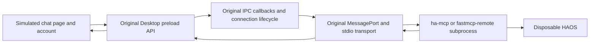

# Chat-session emulation for issue 2367

This is a branch-only experiment. It does not authenticate an Anthropic account
and is not a copy of the complete signed-in Claude web application. All source
extraction, package installation, Electron execution and HAOS tests run on GitHub.

## What changed from the transport harness

The earlier harness supplied a port directly to a Node-enabled test renderer.
Session mode instead loads Desktop's unchanged `mainView.js` preload with browser
context isolation enabled, Node integration disabled and the renderer sandbox on.
A locally served page at the expected Claude origin calls the real
`claudeAppBindings.listMcpServers()` and `connectToMcpServer()` APIs. No request to
that origin leaves the isolated Electron process.

The main process executes extracted, unchanged Desktop declarations for launch,
per-server serialization, shutdown, generation tracking, connection storage and
status updates, plus the actual list/connect IPC callbacks. The preload receives
the native port and forwards it into the page using its original
`mcp-server-connected` window-message handler. Browser-side request bookkeeping
checks duplicate IDs and correlates responses before the simulated chat service
receives them.

The test page calls Desktop's sign-in preparation and account APIs with synthetic
account data. The handlers are local substitutes. This exercises the preload
boundary and post-sign-in session shape, not real account authentication,
subscription checks, server feature flags or the cloud chat backend.

## Source provenance and substitutions

Linux uses official Desktop 1.46388.2. The exact bundle and preload hashes are in
the inspection artifacts. `extract_session.cjs` retains 16 definitions and two
IPC callbacks. `session-shapes.json` contains syntax hashes and identifier-reference
locations, not copied implementation source. The Windows extractor uses those
fingerprints to identify Windows' own declarations, checks their structures and
reference relationships, then binds their application services under a common
test interface. It refuses ambiguous or unmatched mappings.

Runtime services supplied by the harness include server configuration, the empty
built-in/extension registry, account state, UI notifications, idle accessory and
telemetry handlers, and application logging. Plain uvx config selects the legacy
exec path; extension-specific probing and built-in runtimes are outside scope.
The factory uses Desktop's original subprocess transport and process specification;
full application PATH discovery and extension installation are not reproduced.
Unexpected use of an unprovided service raises an error.

The subprocess's stderr writes directly to an asynchronous file stream in the
private test profile, as in Desktop's lifecycle. Application event logging remains
test instrumentation rather than original Winston configuration. Token-bearing
profile files are not uploaded as transport measurements.

## Session transitions

Each HAOS case retains the exact attached dashboard and large transform. It makes
three fresh Desktop starts and thirty calls in a reused Desktop process. During
the reused session it now:

1. Changes the conversation URL while preserving the MCP connection.
2. Reloads the renderer, allowing Desktop's original port-release/shutdown and
   connection queue to replace the old server.
3. Reinitializes MCP on the replacement connection and resumes dashboard calls.

Background reads drain before these deliberate transitions. They do not assert
that requests in flight across an intentional page destruction must survive.
The transitions broaden lifecycle coverage but do not recreate a human's exact
conversation, model tool selection, permission prompts or cloud request queue.

## Initial proof runs

- [34159812203](https://github.com/homeassistant-ai/ha-mcp/actions/runs/34159812203),
  `3007d54f`: actual chat preload/lifecycle passed a large message round trip and
  SDK discovery, resource, prompt and concurrent-tool checks.
- [34160106996](https://github.com/homeassistant-ai/ha-mcp/actions/runs/34160106996),
  `e256cb64`: also passed conversation change and renderer reload, followed by
  the same SDK checks.

The anonymous public-page fetch from the runner returned HTTP 403. The authenticated
web application was not downloaded and no credentials or access-control workaround
were used. Its private session behavior remains the largest emulation gap.

## HAOS results

All three runs tested `e256cb64580b504ce8f3caa529b1fa022cf5ec7a` against HAOS
Core 2026.9.1. Each completed all eight cases, with no skips, failures or errors.

| Topology | Run | Target calls | Session transitions | Slowest target call |
| --- | --- | ---: | ---: | ---: |
| Standalone stdio, bare HAOS | [34160236029](https://github.com/homeassistant-ai/ha-mcp/actions/runs/34160236029) | 264 | 16 | 367 ms |
| Component via stdio bridge | [34160257053](https://github.com/homeassistant-ai/ha-mcp/actions/runs/34160257053) | 264 | 16 | 109 ms |
| App via stdio bridge | [34160259159](https://github.com/homeassistant-ai/ha-mcp/actions/runs/34160259159) | 264 | 16 | 203 ms |

Each run's artifacts record 32 Electron processes, 60 child connections and MCP
initializations, 40 page-ready events (including eight renderer reloads), eight
conversation changes, and 264 verified target attempts. The page reported the
expected origin and no Node access. There were no recorded preload, renderer,
launch or fatal errors. Each target had a preceding Desktop dashboard read and
an independent readback and restoration; each run recorded 1,344 primary test
responses across both Desktop and verification clients, plus secondary reads.

The target payloads were the original large transform and the exact reported
`mdi:music-box-multiple` edit, using the byte-identical attached dashboard. The
latter is already present in that dashboard and correctly leaves its hash
unchanged. Standalone artifacts confirm the component was not loaded and record
removal of both MCP integrations before boot.

These 792 target calls are additional to the earlier transport-only batches.
The reported intermittent hang was not observed. Its cause is still unknown;
this is not a product fix or evidence that the report is resolved.

## Windows session check

The first Windows session attempt, [34160499487](https://github.com/homeassistant-ai/ha-mcp/actions/runs/34160499487),
matched all 18 lifecycle definitions/callbacks and extracted Windows' own code.
Startup then failed because the test application's substitute account handlers
used the Linux build's IPC namespace UUID. Windows' original preload used a
different UUID. The harness now derives that namespace from the actual preload.
This was an emulator setup failure, not the reported dashboard hang.

The final [Windows run 34161119869](https://github.com/homeassistant-ai/ha-mcp/actions/runs/34161119869),
commit `f1b81232`, passed. It ran official Windows Desktop 1.46388.4's extracted
code and unchanged preload in native stock Electron 42.10.0. All 18 selected
lifecycle declarations/callbacks structurally matched the Linux reference with
consistent identifier mappings. This establishes equivalence of those selected
functions, not the complete application or authenticated web client.

Windows preload SHA-256:
`bcc447572fe756293b2bad10cba977441253645b9508e51f46f8d0100e22dcdd`.
The main bundle hash and package provenance are in the extraction artifacts and
[DESKTOP-VERIFICATION.md](DESKTOP-VERIFICATION.md).

Three 102,073-byte echo requests preserved the exact Unicode/template payload:
before transition, after a conversation change, and after renderer reload. The
trace records two child connections, two page-ready events, no page Node access,
and no recorded fatal, launch or renderer errors. The preflight asserted clean
process exit. These are three echo calls, not Windows dashboard stress testing.

The shared session harness also passed the final
[Linux SDK run 34161119842](https://github.com/homeassistant-ai/ha-mcp/actions/runs/34161119842)
at `f1b81232`: the same transition preflight, MCP discovery, resource read, large
prompt and eight concurrent large tool calls. The intervening namespace-detection
attempts 34160989726 and 34160989712 failed before readiness because the bundle
contained multiple IPC namespaces; the final selector targets the chat API
namespace specifically. These setup failures did not execute dashboard attempts.

## Remaining coverage limits

The chat page, its request scheduler and account handlers are test substitutes.
The tests do not reproduce Anthropic authentication, the private cloud web app,
model streaming, approval dialogs, account feature flags or a human conversation.
They cover the client-initiated MCP calls used by these scenarios; arbitrary
server-initiated requests and requests interrupted by page destruction are not
covered. The Windows check uses a local echo subprocess rather than HAOS. The
HAOS dashboard runs still execute on Linux, with current source and Core rather
than the reporter's exact historical versions or full entity population.

